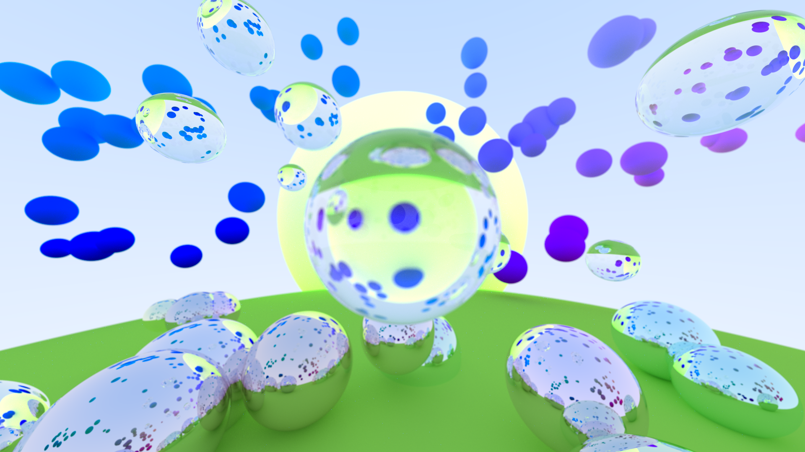

# Raytracing

## Descrição do Projeto

Este projeto segue o tutorial "Ray Tracing in One Weekend" (https://raytracing.github.io/books/RayTracingInOneWeekend.html), que propõe a construção de um renderizador de imagens baseado na técnica de **Ray Tracing**, em C++.

Durante a execução do projeto, o objetivo foi:
1. Compreender os fundamentos de Ray Tracing;
2. Implementar os principais componentes do renderizador;
3. Criar uma cena personalizada com esferas de diferentes materiais;
4. Alterar a posição e direção da câmera para gerar imagens interessantes;
5. Gerar imagens finais no formato '.ppm', que podem ser visualizadas com softwares de imagem compatíveis ou podem ser convetidas no formato '.png'.

## Funcionalidades

- Interseção de raios com esferas;
- Materiais: difusos, metálicos e dielétricos;
- Reflexão e refração de raios;
- Câmera com profundidade de campo;
- Geração de imagens '.ppm'.

## Cena Gerada
A inspiração para a cena foi uma paisagem com um horizonte e um sol ao fundo. Para enriquecer o cenário, foram adicionadas esferas com material dielétrico flutuando no ar, semelhantes a bolhas de sabão. No plano do chão, esferas de metal refletem as esferas da cena. Esferas difusas (lambertian) foram criadas, e inclusive existem algumas atrás da câmera e que são visíveis pelo reflexo das esferas metálicas na intenção de adicionar um elemento visual inesperado. 

Para uma cena mais atraente, as cores dos objetos difusos foram baseadas em suas respectivas posições no espaço, deixando o projeto mais colorido. Ainda sobre eles, foi escolhido deixar os tons azuis e roxos a frente da câmera para dar um contraste interessante com o sol amarelo e o chão verde. Também foi propositalmente colocada uma esfera com material dielétrico bem no centro da imagem para ficar bem visível o efeito de "bolha de sabão". 

A imagem final gerada está disponível dentro do próprio diretório deste projeto com qualidade full HD e em formato PPM (Portable Pixmap).



## Como executar o projeto

### Pré-requisitos

- Compilador C++ (recomendado: g++)
- Terminal (Linux/Mac) ou WSL/Git Bash (no Windows)

### Compilando
```bash
g++ main.cc -o raytracer
```

### Executando
```bash
./raytracer > image.ppm
```

## Visualização da imagem
A imagem renderizada é salva no arquivo 'image.ppm'. É possível abrir esse arquivos com programas como:
- InfanView;
- GIMP;
- Visualizadores de imagem que suportem '.ppm';
- Ou converter para '.png'.

## Bibliografia
- "Ray Tracing in One Weekend" (https://raytracing.github.io/books/RayTracingInOneWeekend.html)
